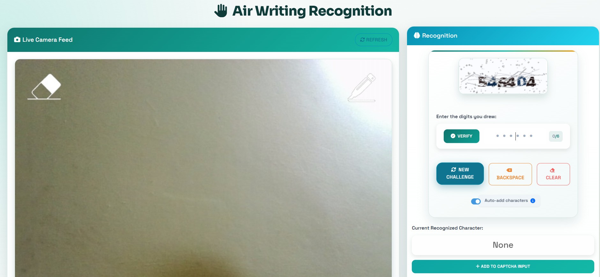

# Air-Written-Captcha-Recognition




A web-based project for air writing and character recognition using OpenCV, Flask, MediaPipe, and TensorFlow.

## Overview
This enhancement improves the numeric captchas in the Air Writing and Character Recognition system to make them more realistic and similar to modern CAPTCHAs used by services like Cloudflare. The enhancements include:

1. More realistic character rendering
2. Better distortion and noise effects
3. Improved color schemes and contrast
4. Variable difficulty levels
5. Training capabilities for better recognition models

## Quick Start

1. To use the enhanced numeric captchas, run:
   ```
   python app.py
   ```

2. The system will automatically use the enhanced captchas when generating numeric captchas.

## Training a Model for CAPTCHA Recognition

To train a model that can recognize the enhanced numeric captchas:

1. Run the setup script:
   ```
   setup_realistic_captcha.bat
   ```

2. Start the training process:
   ```
   python train_realistic_numeric_captcha.py
   ```

3. The training will:
   - Generate a dataset of realistic numeric captchas
   - Train a CNN model to recognize the captchas
   - Evaluate the model performance
   - Save the trained model in the `realistic_numeric_captchas` folder

## Customizing CAPTCHAs

You can customize the captcha generation by modifying parameters in `enhanced_numeric_captcha.py`:

- Change difficulty levels (easy, medium, hard)
- Adjust image dimensions
- Modify distortion parameters
- Add or remove noise effects

## Example Use

```python
# Generate a single captcha
from enhanced_numeric_captcha import EnhancedCaptchaGenerator

# Initialize the generator
generator = EnhancedCaptchaGenerator()

# Generate a captcha with medium difficulty
image, text = generator.generate_single_captcha(difficulty="medium")

# Save or display the image
image.save("example_captcha.png")
print(f"Captcha text: {text}")
```

## Integration with Web Application

The enhanced captcha system is fully integrated with the Flask web application:

1. The system automatically detects the current recognition mode
2. Generates appropriate captchas (numeric, alpha, or alphanumeric)
3. For numeric captchas, uses the enhanced generator
4. Provides validation and verification

## Troubleshooting

If you encounter issues with the enhanced captchas:

1. Ensure all required packages are installed:
   ```
   pip install pillow opencv-python numpy tensorflow matplotlib tqdm
   ```

2. Check that the fonts specified in the generator are available on your system
   - If not, the system will fall back to default fonts

3. If performance is slow, you can reduce the complexity of captchas by editing the difficulty parameters

## Further Development

Future enhancements could include:

1. Adding audio captcha support
2. Implementing more advanced distortion techniques
3. Creating localized captcha variations
4. Adding support for mathematical equations in captchas
